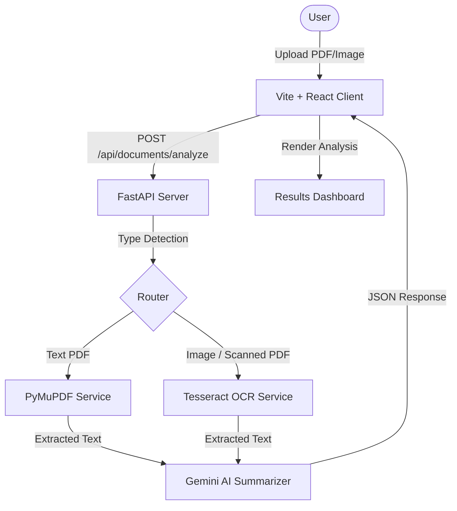

# Document Summary Assistant

An AI-powered document analysis application built as a modern, responsive single-page web application.

The application allows users to upload text-based PDFs, scanned PDFs, or images. It automatically extracts text using structural PDF extraction and Tesseract OCR, then generates structured AI summaries in short, medium, or long formats.

It also provides key points, document statistics, extracted text, and improvement suggestions.

---

## Live Application

### Frontend

https://document-summarizer-two-jet.vercel.app

### Backend

https://document-summarizer-backend-au63.onrender.com

### Backend Health Check

https://document-summarizer-backend-au63.onrender.com/api/documents/health

---

## Features

### 1. Document Upload

- Upload PDF files or images
- Drag-and-drop support
- File picker support
- Supported formats:
  - PDF
  - PNG
  - JPG
  - JPEG
  - WEBP
- Maximum file size: **4 MB**
- Client-side file type and size validation

### 2. Text Extraction

The application automatically determines the appropriate extraction method based on the uploaded document.

#### Text-Based PDFs

Searchable PDFs are processed using **PyMuPDF** to extract text page-by-page while maintaining document structure.

#### Scanned PDFs and Images

Scanned documents and images are processed using:

- Tesseract OCR
- Pillow
- PDF page rendering

The backend is containerized with Tesseract OCR installed, allowing OCR processing on the deployed server.

### 3. AI Summary Generation

The extracted text is analyzed using the **Google Gemini API**.

Users can select three summary lengths:

- Short
- Medium
- Long

The generated output includes:

- Structured summary
- Key points
- Improvement suggestions

Long documents are processed using a chunking/map-reduce strategy to reduce the risk of AI token limits.

### 4. Results Dashboard

After processing, the application displays:

- File name
- File type
- Page count
- Word count
- Character count
- Extraction method
- AI-generated summary
- Key points
- Improvement suggestions
- Extracted document text

Users can switch between short, medium, and long summaries without re-uploading the document.

### 5. User Experience

- Responsive interface
- Drag-and-drop upload
- Loading states
- Multi-step processing indicator
- Summary length selection
- Error handling
- Extracted text viewer
- Upload another document functionality

---

# Architecture

The project uses a decoupled client-server architecture.



## Frontend

The frontend is built using React and Vite.

Responsibilities include:

- File selection
- Drag-and-drop handling
- Client-side file validation
- Uploading documents
- Loading and progress states
- Summary length selection
- Results rendering
- Error handling

## Backend

The backend is built using FastAPI.

Responsibilities include:

- API routing
- File validation
- PDF text extraction
- OCR processing
- AI summarization
- Structured JSON responses
- CORS configuration

## PDF Extraction

**PyMuPDF** is used to extract text from searchable PDF documents page-by-page.

## OCR Service

**Tesseract OCR** and **Pillow** are used for scanned PDFs and image files.

The production backend runs inside a Docker container with Tesseract OCR installed as a system dependency.

## AI Summarization

The **Google Gemini API** analyzes the extracted document text and generates:

- Summary
- Key points
- Improvement suggestions

---

# Tech Stack

## Frontend

- React 19
- Vite
- Tailwind CSS
- Lucide React
- JavaScript

## Backend

- Python 3.11+
- FastAPI
- PyMuPDF
- Pillow
- PyTesseract
- Google Gemini API
- PyTest

## OCR

- Tesseract OCR
- Pillow

## Containerization

- Docker
- Python 3.11 Slim

## Deployment

- Vercel — Frontend
- Render — Backend
- GitHub — Source Control

---

# Project Structure

```text
Document_Summarizer/

├── backend/
│   ├── app/
│   │   ├── routes/
│   │   │   └── document.py
│   │   │       # Analyze and health endpoints
│   │   │
│   │   ├── schemas/
│   │   │   └── document.py
│   │   │       # API response models
│   │   │
│   │   ├── services/
│   │   │   ├── pdf_extractor.py
│   │   │   │   # PyMuPDF text extraction
│   │   │   │
│   │   │   ├── ocr_service.py
│   │   │   │   # Pillow + Tesseract OCR
│   │   │   │
│   │   │   └── summarizer.py
│   │   │       # Gemini AI integration
│   │   │
│   │   ├── utils/
│   │   │   └── file_validation.py
│   │   │       # File extension, MIME and size validation
│   │   │
│   │   └── main.py
│   │       # FastAPI entry point and CORS configuration
│   │
│   ├── tests/
│   │   └── test_endpoints.py
│   │
│   ├── Dockerfile
│   ├── requirements.txt
│   ├── .env.example
│   └── vercel.json
│
├── frontend/
│   ├── src/
│   │   ├── assets/
│   │   ├── App.jsx
│   │   │   # Main React application
│   │   │
│   │   ├── App.css
│   │   │   # Component styling
│   │   │
│   │   ├── index.css
│   │   │   # Global styles and Tailwind imports
│   │   │
│   │   └── main.jsx
│   │       # React application bootstrap
│   │
│   ├── index.html
│   ├── tailwind.config.js
│   ├── postcss.config.js
│   └── package.json
│
└── README.md
```

---

# Local Setup

## Backend Setup

### 1. Navigate to the backend

```bash
cd backend
```

### 2. Create a virtual environment

```bash
python -m venv venv
```

Activate it on Windows:

```powershell
venv\Scripts\activate
```

Activate it on macOS/Linux:

```bash
source venv/bin/activate
```

### 3. Install dependencies

```bash
pip install -r requirements.txt
```

### 4. Configure environment variables

Create a `.env` file based on `.env.example`.

```env
GEMINI_API_KEY=your_gemini_api_key_here
GEMINI_MODEL=gemini-2.5-flash
CORS_ORIGINS=http://localhost:5173
```

> **Security:** Never commit your actual Gemini API key to GitHub.

### 5. Install Tesseract OCR

Tesseract is required for scanned documents and image OCR when running the backend locally.

#### Windows

Install Tesseract OCR and either add it to your system PATH or configure its executable path.

Example:

```env
TESSERACT_CMD=C:\Program Files\Tesseract-OCR\tesseract.exe
```

#### macOS

```bash
brew install tesseract
```

#### Linux

```bash
sudo apt-get update
sudo apt-get install tesseract-ocr
```

### 6. Start the backend

From the `backend` directory:

```bash
python -m uvicorn app.main:app --host 0.0.0.0 --port 8000 --reload
```

The backend will be available at:

```text
http://localhost:8000
```

### 7. Verify the backend

Open:

```text
http://localhost:8000/api/documents/health
```

Expected response:

```json
{
  "status": "ok",
  "message": "Document Summary Assistant API is healthy."
}
```

### 8. Run backend tests

On Windows PowerShell:

```powershell
$env:PYTHONPATH="."
pytest tests/test_endpoints.py
```

---

# Frontend Setup

### 1. Navigate to the frontend

```bash
cd frontend
```

### 2. Install dependencies

```bash
npm install
```

### 3. Configure the backend URL

Create a `.env` file inside the `frontend` directory:

```env
VITE_API_URL=http://localhost:8000
```

### 4. Start the frontend

```bash
npm run dev
```

The development application will normally be available at:

```text
http://localhost:5173
```

---

# File Upload Limits

The application currently supports files up to **4 MB**.

## Supported formats

```text
PDF
PNG
JPG
JPEG
WEBP
```

Files are validated for:

- File size
- MIME type
- Supported format
- Empty file detection

Files larger than **4 MB** are rejected before processing.

---

# API Documentation

## 1. Health Check

### Endpoint

```http
GET /api/documents/health
```

### Production URL

```text
https://document-summarizer-backend-au63.onrender.com/api/documents/health
```

### Example Response

```json
{
  "status": "ok",
  "message": "Document Summary Assistant API is healthy."
}
```

---

## 2. Analyze Document

### Endpoint

```http
POST /api/documents/analyze
```

### Production URL

```text
https://document-summarizer-backend-au63.onrender.com/api/documents/analyze
```

### Request Format

```text
multipart/form-data
```

### Fields

| Field | Type | Description |
|---|---|---|
| `file` | File | PDF or image document |
| `summary_length` | String | `short`, `medium`, or `long` |

### Supported File Types

```text
PDF
PNG
JPG
JPEG
WEBP
```

### Example Response

```json
{
  "filename": "annual_report.pdf",
  "file_type": "PDF",
  "page_count": 5,
  "word_count": 1420,
  "character_count": 8900,
  "extraction_method": "pdf_text",
  "summary": "This document outlines...",
  "key_points": [
    "Q4 Revenue increased by 15%",
    "Operating costs were reduced"
  ],
  "improvement_suggestions": [
    "Add detail regarding future risks",
    "Include a table for quarterly breakdowns"
  ],
  "extracted_text": "ANNUAL REPORT 2026..."
}
```

---

# Document Processing Flow

```text
User uploads document
        |
        v
Client-side validation
        |
        v
File sent to FastAPI
        |
        v
File type detection
        |
        +-------------------------+
        |                         |
        v                         v
Searchable PDF             Image / Scanned PDF
        |                         |
        v                         v
    PyMuPDF                 Tesseract OCR
        |                         |
        +------------+------------+
                     |
                     v
              Extracted Text
                     |
                     v
                Text Chunking
                     |
                     v
                 Gemini AI
                     |
                     v
          Structured JSON Response
                     |
                     v
            React Results Dashboard
```

---

# Deployment

## Frontend Deployment — Vercel

The React/Vite frontend is deployed using Vercel.

### Live Frontend

```text
https://document-summarizer-two-jet.vercel.app
```

### Build Configuration

```text
Framework Preset: Vite
Build Command: npm run build
Output Directory: dist
```

### Environment Variable

The deployed frontend uses:

```env
VITE_API_URL=https://document-summarizer-backend-au63.onrender.com
```

This allows the frontend to communicate with the production FastAPI backend hosted on Render.

---

# Backend Deployment — Render

The FastAPI backend is deployed using Render.

### Live Backend

```text
https://document-summarizer-backend-au63.onrender.com
```

### Backend Health Check

```text
https://document-summarizer-backend-au63.onrender.com/api/documents/health
```

### Render Configuration

The backend is deployed as a Docker-based web service.

```text
Language: Docker
Root Directory: backend
```

The Dockerfile installs:

- Python 3.11
- Tesseract OCR
- Required system libraries
- Python dependencies

The container starts FastAPI using Uvicorn.

### Dockerfile

```dockerfile
FROM python:3.11-slim

# Install system dependencies required for OCR
RUN apt-get update && apt-get install -y \
    tesseract-ocr \
    libgl1 \
    libglib2.0-0 \
    && rm -rf /var/lib/apt/lists/*

# Set working directory
WORKDIR /app

# Copy backend files
COPY . .

# Install Python dependencies
RUN pip install --no-cache-dir -r requirements.txt

# Render provides the PORT environment variable
CMD ["sh", "-c", "uvicorn app.main:app --host 0.0.0.0 --port ${PORT:-8000}"]
```

### Render Environment Variables

The backend requires:

```env
GEMINI_API_KEY=your_gemini_api_key
GEMINI_MODEL=gemini-2.5-flash
CORS_ORIGINS=https://document-summarizer-two-jet.vercel.app
```

> **Important:** The actual Gemini API key should be stored only in Render environment variables and must never be committed to GitHub.

### Production API

The deployed backend provides:

```http
GET  /api/documents/health
POST /api/documents/analyze
```

---

# OCR in Production

One of the reasons for deploying the backend with Docker is to make Tesseract OCR available on the server.

The production container installs Tesseract using:

```dockerfile
RUN apt-get update && apt-get install -y tesseract-ocr
```

Therefore, scanned PDFs and supported image files can be processed without requiring Tesseract to be installed on the user's computer.

The user only needs a browser to access the application.

---

# Testing

The backend includes endpoint tests using PyTest.

Run:

```powershell
$env:PYTHONPATH="."
pytest tests/test_endpoints.py
```

Testing includes important API behavior such as:

- Health endpoint
- Document upload
- File validation
- Invalid file handling
- API response structure

---

# Error Handling

The application includes error handling across both frontend and backend.

## Frontend

The frontend handles:

- Unsupported file types
- Empty files
- Files larger than 4 MB
- API failures
- Summary generation failures
- Loading states

## Backend

The backend handles:

- File type validation
- MIME type validation
- File size validation
- PDF extraction failures
- OCR processing failures
- AI API errors

---

# Limitations

## OCR Quality

OCR accuracy depends on:

- Image resolution
- Document quality
- Lighting
- Font style
- Document layout

## File Size

The current maximum upload size is:

**4 MB**

## Large Documents

To reduce the risk of exceeding AI token limits, documents containing large amounts of extracted text are divided into chunks and processed separately.

Documents exceeding approximately 30,000 characters may be processed using a chunking and map-reduce strategy.

Some cross-page context may therefore be generalized.

## AI Dependency

Summary generation requires an active connection to the Google Gemini API.

Gemini API rate limits may apply depending on the API account and selected model.

If the available Gemini quota is exhausted, summary generation may temporarily fail until the quota becomes available again or the API account's limits are increased.

## Render Free Tier

The backend is hosted on Render's free instance for this project.

Free hosting may have limitations such as:

- Cold starts after inactivity
- Limited CPU and memory
- Slower processing for OCR-heavy documents
- Temporary service availability limitations

---

# Future Improvements

1. **Export Capabilities**
   - Export summaries to PDF or Word documents.

2. **Multilingual OCR**
   - Support OCR for multiple languages.

3. **Document History**
   - Store previously processed documents locally or using a database.

4. **Context Citations**
   - Add page-specific references to generated key points and summaries.

5. **Larger File Support**
   - Increase the upload limit using scalable storage and asynchronous document processing.

6. **Advanced Document Understanding**
   - Add table extraction, document classification, and layout-aware analysis.

7. **Improved AI Resilience**
   - Add retry handling, better quota handling, and alternative AI providers.

---

# Security Considerations

- API keys are stored using environment variables.
- Sensitive `.env` files should not be committed to GitHub.
- File type and size validation are performed before processing.
- CORS is configured to restrict API access to the approved frontend origin.
- The Gemini API key is stored as a server-side environment variable.
- API credentials are never exposed through the frontend.

---

# Project Goals

This project demonstrates:

- Full-stack application development
- REST API development with FastAPI
- React frontend development
- PDF processing
- OCR integration
- AI API integration
- File validation
- Error handling
- Responsive UI/UX
- Docker containerization
- Cloud deployment
- Client-server architecture
- Automated testing

---

# Author

**Vasanthi Jonnakuti**

B.Tech Computer Science & Engineering

Vellore Institute of Technology, Andhra Pradesh